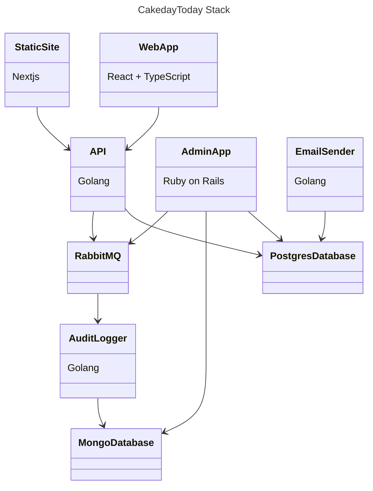
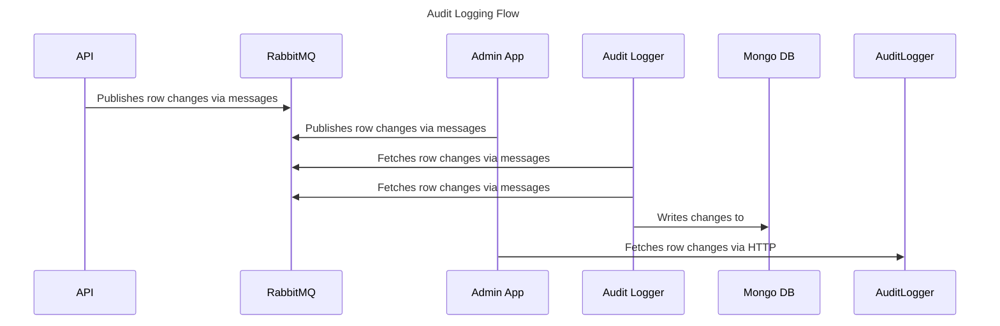

# 🎁 Birthday Project

Birhday project is a project for companies to send birthday emails to their employees on their birthdays automatically.

## Tech Stack

```mermaid
---
title: CakedayToday Stack
---

classDiagram

API --> Postgres Database
Web App --> API
Admin App --> Postgres Database
Admin App --> Mongo Database
Email Sender --> Postgres Database
API --> RabbitMQ
Admin App --> RabbitMQ
RabbitMQ --> Audit Logger
Audit Logger --> Mongo Database
Static Site --> API

API : Golang
Web App : React + TypeScript
Email Sender : Golang
Audit Logger : Golang
Admin App : Ruby on Rails
Static Site : Nextjs

```

## Flows

```mermaid
---
title : Audit Logging Flow
---

sequenceDiagram
    API ->> RabbitMQ : Publishes row changes via messages
    Admin App ->> RabbitMQ : Publishes row changes via messages

    Audit Logger ->> RabbitMQ : Fetches row changes via messages
    Audit Logger ->> RabbitMQ : Fetches row changes via messages
    Audit Logger ->> Mongo DB : Writes changes to

    Admin App ->> AuditLogger : Fetches row changes via HTTP
```

